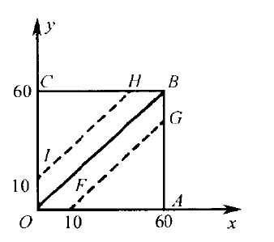

- [1. 样本空间与随机事件](#1-样本空间与随机事件)
  - [1.1 样本空间](#11-样本空间)
  - [1.2 随机事件](#12-随机事件)
  - [1.3 事件间的关系与运算](#13-事件间的关系与运算)
- [2. 频率与概率](#2-频率与概率)
- [3. 等可能概型 (古典概型)](#3-等可能概型-古典概型)
  - [3.1 常见的数学模型](#31-常见的数学模型)
  - [3.2 实际推断原理](#32-实际推断原理)
- [4. 条件概率](#4-条件概率)
  - [4.1 乘法定理](#41-乘法定理)
  - [4.2 全概率公式](#42-全概率公式)
  - [4.3 贝叶斯公式](#43-贝叶斯公式)
- [5. 事件的独立性](#5-事件的独立性)

研究不确定性，定量描述随机现象及其规律

## 1. 样本空间与随机事件

自然界与社会生活中的两种现象：

1. 确定性现象：在一定条件下必然发生
2. 随机现象：在一定条件下具有多种可能的结果，且无法预知

> **随机试验**：对随机现象的观察、记录、实验
>
> - (复现) 可在相同条件下重复进行
> - (可知) 事先知道所有可能的结果
> - (不可预知) 试验前不知道哪个结果会发生

### 1.1 样本空间

> **样本空间**：随机试验的所有可能结果，记为 $S = \{e\}$
>
> **样本点**：$S$ 中的元素 $e$

  
例

- 抛一枚硬币一次：

  $S = \{正面, 反面\}$

- 记录一座城市一天之中发生的交通事故次数

  $S = \{0,1,2,...\}$

- 记录一批产品的寿命

  $S = \{x:x\ge0\}$

- 记录某地一昼夜的最高温度和最低温度

  $S = \{(x,y):a \le y \le x \le b\}$

### 1.2 随机事件

> **随机事件**：样本空间 $S$ 的子集 $A$ 称为**随机事件$A$**，简称事件$A$
>
> **事件$A$发生**：当且仅当 $A$ 中的某个样本点发生

> **必然事件**：样本空间 $S$；每次试验总是发生
>
> **基本事件**：事件只含有一个样本点
>
> **不可能事件**：事件不包含任何样本点；记作 $\emptyset$

  
例

观察某公交站的候车人数：

$S = \{0,1,2,...\}$

- 事件 $A$：至少 5 人候车

  $A = \{5,6,7,...\}$

- 事件 $B$：候车人数不多于 2 人

  $B = \{0,1,2\}$

- 事件 $C$：恰好有 3 人候车

  $C = \{3\}$ 为基本事件

- 事件 $D$：候车人数既少于 3 又多于 3

  $D = \emptyset$ 为不可能事件

### 1.3 事件间的关系与运算

- 包含： $A \subset B$ ($A$ 发生 $B$ 一定发生)
- 相等： $A = B$
- 和事件： $A \cup B = \{x \mid x \in A 或 x \in B\}$ ($A$ 与 $B$ 至少有一个发生)

  $$\bigcup_{i=1}^{n}A_{i}$$

- 积事件： $A \cap B$ 或 $A \cdot B$ 或 $AB$ ($A$ 与 $B$ 同时发生)

  $$\bigcap_{i=1}^{n}A_{i}$$

- 不相容： $AB = \emptyset$ ($A$ 与 $B$ 不会同时发生)
- 逆事件： $\overline{A}$

  $A \cup \overline{A} = S$, $A\overline{A} = \emptyset$, $\overline{\overline{A}} = A$

- 差事件： $A - B = \{x \mid x \in A 且 x \notin B\}$

  $A - B = A\overline{B} = A \cup B - B = A  - AB$

运算定律：

- 交换律：

  - $A \cup B = B \cup A$
  - $A \cap B = B \cap A$

- 结合律：

  - $A \cup (B \cup C) = (A \cup B) \cup C$
  - $A \cap (B \cap C) = (A \cap B) \cap C$

- 分配律：

  - $A \cup (B \cap C) = (A \cup B) \cap (A \cup C)$
  - $A \cap (B \cup C) = (A \cap B) \cup (A \cap C)$

- 对偶律 (德摩根定律)：

  - $\overline{A \cup B} = \overline{A} \cap \overline{B}$
  - $\overline{A \cap B} = \overline{A} \cup \overline{B}$

- 对偶律推广：

  $$\bigcap_{i=1}^{n}A_{i} = \bigcup_{i=1}^{n}\overline{A_{i}}$$
  $$\bigcup_{i=1}^{n}A_{i} = \bigcap_{i=1}^{n}\overline{A_{i}}$$

## 2. 频率与概率

> **频率**： 基于大量重复试验，对随机事件发生可能性的估计 (0 ~ 1)
>
> $$f_{n}(A) = \frac{n_{A}}{n}$$

频率的性质：

1. $0 \le f_{n}(A) \le 1$
2. $f_{n}(S) = 1$
3. 若 $A_1，A_2, ... A_k$ 两两互不相容，则

   $$f_{n}(\bigcup_{i=1}^{k}A_{i}) = \sum_{i=1}^{k}f_{n}(A_{i})$$

> **概率**： $f_{n}(A)$ 随着试验次数增加而趋于稳定的值，记作 $P(A) = p$
>
> 1. $0 \le P(A) \le 1$
> 2. $P(S) = 1$
> 3. (可列可加性) 若 $A_{i}A_{j} = \emptyset, i\neq j$ ，则
>
>    $$P(\bigcup_{i=1}^{\infty}A_{i}) = \sum_{i=1}^{\infty}P(A_{i})$$

概率的性质：

1. $P(\emptyset) = 0$
2. $P(A) = 1 - P(\overline{A})$
3. (有限可加性) 若 $A_{i}A_{j} = \emptyset, 1 \leq i \leq n, 1 \leq j \leq n, i\neq j$ ，则

   $$P(\bigcup_{i=1}^{n}A_{i}) = \sum_{i=1}^{n}P(A_{i})$$

4. 若 $A \subset B$ ，则 $P(B-A) = P(B) - P(A)$
5. 加法公式

   $$P(\bigcup_{i=1}^{n}A_{i}) = \sum_{i=1}^{n}P(A_{i}) - \sum_{1 \leq i \leq j \leq n}P(A_{i}A_{j}) + \ldots + (-1)^{n-1}P(A_1A_2 \ldots A_n)$$

## 3. 等可能概型 (古典概型)

> **等可能概型**：
>
> - $S$ 中的样本点有限
> - 出现每一个样本点的概率相等

$$P(A) = \frac{A中的样本点数}{S中的样本点数}$$

### 3.1 常见的数学模型

- 二元的放回抽样

  - 所有选项数量为 1

    每次抽样都有 2 种可能，$k$ 次抽样有 $2^k$ 种可能

    每次抽样都是同一个选项的概率为 $\frac{1}{2^k}$

    

      
抛硬币

    选项：

    1. 正面 H (1 个)
    2. 反面 T (1 个)

    

  - 每个选项数量大于等于 1 (分别为 $a$ 和 $b$)

    每次抽样都有 $a+b$ 种可能，$n$ 次抽样有 $(a+b)^n$ 种可能

    - 每次抽样都是同一个选项的概率为 $\frac{a^n}{(a+b)^n}$ 或 $\frac{b^n}{(a+b)^n}$
    - 第 $k$ 次抽样是某个选项的概率为 $p = \frac{a}{a+b}$

    

      
袋中取球 (红或白)

    选项：

    1. 红球 (a 个)
    2. 白球 (b 个)

    

- 二元的不放回抽样

  每个选项数量大于等于 1 (分别为 $a$ 和 $b$)

  抽样 $n$ 次 ($n \leq a+b$)，共有 $A_{(a+b)}^{n} = \frac{(a+b)!}{(a+b-n)!}$ 种可能

  - 每次抽样都是同一个选项的概率为 $p = \frac{A_{a}^{n}}{A_{(a+b)}^{n}}$ ($n \leq a$)
  - 有 $k$ 个某选项的概率为 $p = \frac{A_{a}^{k}A_{b}^{n-k}}{A_{(a+b)}^{n}}$ ($k \leq a$)(**超几何分布的概率公式**)
  - 第 $k$ 次抽样是某个选项的概率为 $p = \frac{A_{a}^{1}A_{a+b-1}^{k-1}}{A_{a+b}^{k}} = \frac{a}{a+b}$

- $N$ 元的放回抽样

  选项数量为 $N$ ，抽样 $n$ 次 ($n \leq N$)

  每次抽样都是不同选项的概率为 $p = \frac{A_{N}^{n}}{N^n}$

  

    
例

  - 将 $n$ 只球放入 $N$ 个盒子中
  - $n$ 个人的生日

  

### 3.2 实际推断原理

概率很小的事件在一次试验中实际上几乎是不发生的

### 3.3 几何概率

等可能概型局限于有限个样本点

将其引申至无限多的试验结果，可以得到几何概率；即基于几何图形的长度、面积、体积的计算得出

  
例

甲、乙约定在 1 点 ~ 2 点间碰头，先到者等待 10 分钟后离开。甲、乙随意地选择到达的时刻，则碰面的概率为：

$P(E) = \frac{1100}{3600} = \frac{11}{36}$

## 4. 条件概率

设 $A, B$ 是两个事件，且 $P(A) \gt 0$ ，称
$$P(B \mid A) = \frac{P(AB)}{P(A)}$$
为事件 $A$ 发生的条件下事件 $B$ 发生的条件概率

条件概率符合概率的定义和特性

(可以考虑为缩小了样本空间 $S$ 至 $A$)

### 4.1 乘法定理

> **乘法定理**：由条件概率的定义可得：设 $P(A) \gt 0$ ，则有
> $$P(AB) = P(B \mid A)P(A)$$

上述乘法公式也可以推广到多个事件的积事件

### 4.2 全概率公式

> **划分**：设 $S$ 为试验 $E$ 的样本空间，$B_1, B_2, \ldots, B_n$ 为 $E$ 的一组事件。若
>
> 1. $B_iB_j = \emptyset, i \neq j, i,j=1,2,\ldots,n$
> 2. $B_1 \cup B_2 \cup \ldots \cup B_n = S$
>
> 则称 $B_1, B_2, \ldots, B_n$ 是样本空间 $S$ 的一个划分
>
> 对每次试验，$B_1, B_2, \ldots, B_n$ 中必有一个且仅有一个发生

> **全概率公式**：设试验 $E$ 的样本空间为 $S$ ，$A$ 为 $E$ 的事件，$B_1, B_2, \ldots, B_n$ 为 $S$ 的一个划分，且 $P(B_i) \gt 0 (i = 1,2,\ldots,n)$ ，则
> $$P(A) = \sum_{i=1}^{n}P(A \mid B_i)P(B_i)$$

### 4.3 贝叶斯公式

> **贝叶斯公式**：设试验 $E$ 的样本空间为 $S$ ，$A$ 为 $E$ 的事件，$B_1, B_2, \ldots, B_n$ 为 $S$ 的一个划分，且 $P(A) \gt 0$，$P(B_i) \gt 0 (i = 1,2,\ldots,n)$ ，则
> $$P(B_i \mid A) = \frac{P(A \mid B_i)P(B_i)}{\sum_{j=1}^{n}P(A \mid B_j)P(B_j)} = \frac{P(B_iA)}{P(A)}$$

> **先验概率**：由以往的数据分析得到
>
> **后验概率**：得到信息后加以修正的概率

## 5. 事件的独立性

> **相互独立**：设 $A,B$ 是两事件，若
> $$P(AB) = P(A)P(B)$$
> 则称事件 $A,B$ 相互独立
>
> 1. 设 $A,B$ 是两事件，且 $P(A) \gt 0$ ，若 $A,B$ 相互独立，则 $P(B \mid A) = P(B)$ ，反之亦然
> 2. 若事件 $A,B$ 相互独立，则下列事件也相互独立：
>    $A$ 与 $\overline{B}$, $\overline{A}$ 与 $B$, $\overline{A}$ 与 $\overline{B}$

以上定义可推广到任意多个事件

注意与 _互不相容事件_ 的区别
