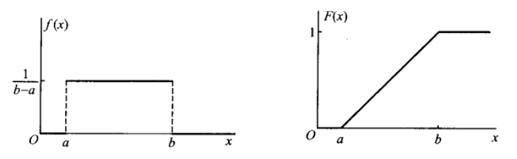
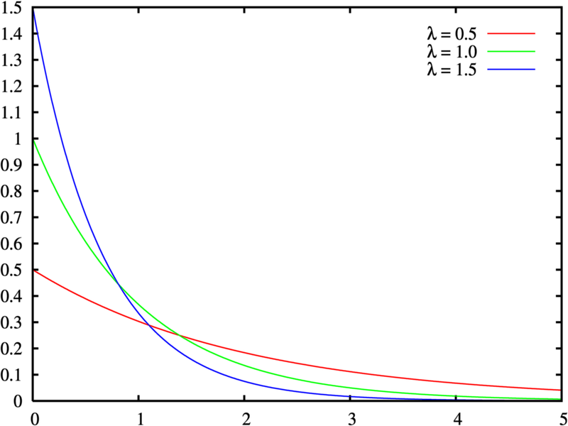
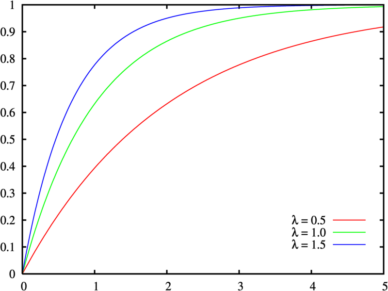
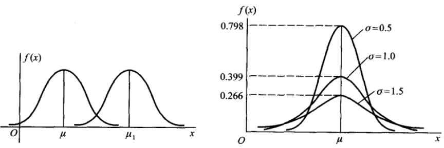
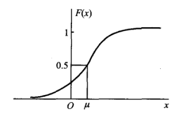

# 1. 随机变量

> 设随机试验的样本空间为 $S = \{e\}$ ，定义在样本空间 $S$ 上的实值单值函数 $X = X\{e\}$ 为**随机变量** (random variable)

(为了便于研究非数的试验结果)

随机变量的取值由试验结果决定，

各个试验结果，即各个事件的发生有各自的概率，

因此随机变量的取值也有一定的概率

  
例

抛一枚硬币三次，出现正面的次数：

$$
X= X(e) =
\begin{cases}
    3, & e=HHH, \\
    2, & e=HHT,HTH,THH, \\
    1, & e=HTT,THT,TTH, \\
    0, & e=TTT
\end{cases}
$$

则 $\{X=2\}$ 对应于事件 $A = \{HHT,HTH,THH\}$ ，

$\{X=2\}$ 的概率 $P(\{X=2\}) = P(A) = 3/8$

# 2. 离散型随机变量

> **离散型随机变量**：可以取到的值是有限个或可列无限多个的随机变量

> **分布律**：设离散型随机变量 $X$ 所有可能的取值为 $x_k (k = 1,2,\ldots)$ ，$X$ 取各个可能值的概率，即事件 $\{X=x_k\}$ 的概率为
> $$P\{X=x_k\} = p_k, k=1,2,\ldots$$

由概率定义可知：

1. $p_k \ge 0, k=1,2,\ldots$
2. $\sum_{k=1}^{\infty}p_k=1$

分布律也可以用表格的形式来表示
| X || x_1 | x_2 | \ldots | x_n |
|-----|-|---------------|---------------|--------|--------------|
| p_k || p_1 | p_2 | \ldots | p_n |

## 2.1 伯努利试验

> **伯努利试验**：试验只有两个可能的结果 $A$ 和 $\overline{A}$
>
> 设 $P(A) = p \quad (0 \lt p \lt 1)$ ，此时 $P(\overline{A}) = q = 1-p$

> **n 重伯努利试验**：将上述试验独立地重复 n 次

以 $C_i$ 记第 $i$ 次试验的结果，$C_i$ 为 $A$ 或 $\overline{A}$ ，$i=1,2,\ldots,n$ ，则
$$P(C_1C_2 \ldots C_n) = P(C_1)P(C_2)\ldots P(C_n)$$

### 2.1.1 二项分布

n 重伯努利试验中，事件 $A$ **发生的次数**为 $k$ 的概率：
$$p\{X=k\} = \binom{n}{k}p^kq^{n-k}$$

这个概率同样满足：

1. $P\{X=k\} \ge 0, k=0,1,2,\ldots,n$
2. $\sum_{k=0}^{n}P\{X=k\} = \sum_{k=0}^{n}\binom{n}{k}p^kq^{n-k} = (p+q)^n = 1$

称随机变量 $X$ 服从参数为 $n,p$ 的二项分布，并记为 $X \sim b(n,p)$

## 2.2 (0-1)分布

> **(0-1)分布**：随机变量 $X$ 只可能取 0 与 1 两个值，其分布律为
> $$P\{X=k\}=p^k(1-p)^{1-k}, k=0,1$$

(0-1)分布是 $n=1$ 时的二项分布

## 2.3 泊松分布

> **泊松分布**：随机变量 $X$ 的所有可能取值为 $0,1,2,\ldots$ ，而取各个值的概率满足
> $$P\{X=k\} = \frac{\lambda^{k}e^{-\lambda}}{k!}, k = 0,1,2,\ldots$$
> 记为 $X \sim \pi(\lambda)$
>
> 其中 $\lambda \gt 0$ 是常数

多用于描述稀有事件发生的概率

对于二项分布，当 $n$ 很大 ($n \geq 20$) 且 $p$ 很小 ($p \leq 0.05$) 时，可以使用泊松分布作近似计算；其中 $\lambda = np$

  
例

- 一本书一页中的印刷错误数
- 某医院一天内的急诊病人数
- 某一地区一段时间内发生交通事故的次数

# 3. 随机变量的分布函数

非离散型随机变量的值无法一一列出

且对任一实数值，其概率通常为 0

因此不对某一特定值的概率进行研究，而是研究值在某一区间内 ($(x_1, x_2]$) 概率 $P\{x_1 \leq X \leq x_2\} = P\{X \leq x_2\} - P\{X \leq x_1\}$

> 设 $X$ 是一个随机变量，$x$ 是任意实数，函数
> $$F(x) = P\{X \leq x\}, -\infty \lt x \lt \infty$$
> 称为 $X$ 的**分布函数**

对于任意实数 $x_1,x_2 (x_1 \lt x_2)$，有
$$P\{x_1 \lt X \leq x_2\} = P\{X \leq x_2\} - P\{X \leq x_1\} \\ = F(x_2) - F(x_1)$$

## 3.1 分布函数的性质

1. 不减
2. $0 \leq F(x) \leq 1$ ，且
   $$F(-\infty) = \lim_{x \rightarrow -\infty}F(x) = 0$$
   $$F(\infty) = \lim_{x \rightarrow \infty}F(x) = 1$$
3. $F(x+0) = F(x)$

## 3.2 离散型随机变量的分布函数

设离散型随机变量 $X$ 的分布律为
$$P\{X=X_k\} = p_k, \quad k=1,2,\ldots$$
则分布函数为
$$F(x) = P\{X \leq x\} = \sum_{x_k \leq x}P\{X = x_k\} = \sum_{x_k \leq x}p_k$$

# 4. 连续型随机变量及其概率密度

> 若对于随机变量 $X$ 的分布函数 $F(x)$ ，存在非负函数 $f(x)$ ，使得对于任意实数 $x$ 有
> $$F(x) = \int_{-\infty}^{\infty}f(t)dt$$
> 则称 $X$ 为 **连续型随机变量**，
>
> 其中函数 $f(x)$ 称为 $X$ 的 **概率密度函数**，简称 **概率密度**

$f(x)$ 的性质：

1. $f(x) \geq 0$
2. $\int_{-\infty}^{\infty}f(x)dx=1$ (即曲线 $y=f(x)$ 与 $x$ 轴之间的面积等于 1)
3. 对于任意实数 $x_1,x_2 (x_1 \leq x_2)$ ，
   $$P\{x_1 \lt X \leq x_2\} = F(x_2) - F(x_1) = \int_{x_1}^{x_2}f(x)dx$$
4. 若 $f(x)$ 在点 $x$ 处连续，则有 $F'(x) = f(x)$

由于对于连续型随机变量 $X$ 来说，其取任一指定实数 $a$ 的概率均为 0，因此在计算连续型随机变量落在某一区间的概率时，可以不必区分区间的开闭，即
$$P\{a \lt X \leq b\} = P\{a \leq X \leq b\} = P\{a \lt X \lt b\}$$

## 4.1 均匀分布

> **均匀分布**：
>
> $$
> f(x) =
> \begin{cases}
>    \frac{1}{b-a}, & a \lt x \lt b, \\
>    0, & 其他
> \end{cases}
> $$
>
> 记为 $X \sim U(a,b)$

$X$ 落在 $(a,b)$ 的子区间内的概率只与子区间的长度有关，与子区间的位置无关

$$P\{c \lt X \leq c + l\} = \int_{c}^{c+l}f(x)dx = \int_{c}^{c+l}\frac{1}{b-a}dx = \frac{l}{b-a}$$
($a \leq c \lt c+l \leq b$)

其分布函数为：

$$
F(x) =
 \begin{cases}
    0, & x \lt a, \\
    \frac{x-a}{b-a}, & a \leq x \lt b, \\
    1, & x \geq b
 \end{cases}
$$

## 4.2 指数分布

> **指数分布**：
>
> $$
> f(x) =
> \begin{cases}
>    \frac{1}{\theta}e^{-\frac{x}{\theta}}, & x \gt 0 \\
>    0, & x \leq 0
> \end{cases}
> $$
>
> 或
>
> $$
> f(x) =
> \begin{cases}
>    \lambda e^{-\lambda x}, & x \gt 0 \\
>    0, & x \leq 0
> \end{cases}
> $$
>
> 其中 $\theta = \frac{1}{\lambda} \gt 0$ 为常数

其分布函数为：

$$
F(x) =
 \begin{cases}
    1-e^{-\frac{x}{\theta}}, & x \gt 0 \\
    0, & x \leq 0
 \end{cases}
$$

指数分布描述了无老化时的寿命分布 (只是一种近似)，而 $\lambda$ 是失效率

### 4.2.1 无记忆性

对于任意 $s, t \gt 0$ ，有
$$P\{X \gt s+t \mid X \gt s\} = p\{X \gt t\}$$

## 4.3 韦伯分布

当考虑老化时，失效率应随时间上升

> 概率密度：
>
> $$
> f(x) =
> \begin{cases}
>    \lambda a x^{a-1} e^{-\lambda x^a}, & x \gt 0 \\
>    0, & x \leq 0
> \end{cases}
> $$
>
> 分布函数：
>
> $$
> F(x) =
> \begin{cases}
>    1 - e^{-\lambda x^a}, & x \gt 0 \\
>    0, & x \leq 0
> \end{cases}
> $$

指数分布是当 $a=1$ 时的特例

## 4.4 正态分布

也称**高斯分布**

> **正态分布**：
>
> $$
> f(x) = \frac{1}{\sqrt{2\pi}\sigma}e^{-\frac{(x-\mu)^2}{2\sigma^2}}, -\infty \lt x \lt \infty
> $$
>
> 其中 $\sigma \gt 0, \mu$ 为常数
>
> 记为 $X \sim N(\mu,\sigma^2)$
> 正态分布的性质：

1. 曲线关于 $x=\mu$ 对称
2. 当 $x=\mu$ 时取到最大值 $f(\mu) = \frac{1}{\sqrt{2\pi}\sigma}$

其分布函数为：
$$F(x) = \frac{1}{\sqrt{2\pi}\sigma}\int_{-\infty}^{x}e^{-\frac{(t-\mu)^2}{2\sigma^2}}dt$$

### 4.3.1 标准正态分布

> **标准正态分布**：
> $\mu=0,\sigma=1$ 的正态分布
>
> 概率密度：
> $$\phi(x) = \frac{1}{\sqrt{2\pi}}e^{-\frac{t^2}{2}}$$
> 分布函数：
> $$\Phi(x) = \frac{1}{\sqrt{2\pi}}\int_{-\infty}^{x}e^{-\frac{t^2}{2}}dt$$

$\Phi(-x) = 1 - \Phi(x)$

将正态分布转化为标准正态分布：

$X \sim N(\mu,\sigma^2)$

$Z = \frac{X-\mu}{\sigma} \sim N(0,1)$

# 5. 随机变量的函数的分布

由已知的随机变量 $X$ 的概率分布求其函数 $Y = g(X)$ 的概率分布

$F_{y}(y) = P(Y \leq y) = P(g(x) \leq y) = \int_{g(x) \leq y}f(x)dx$
