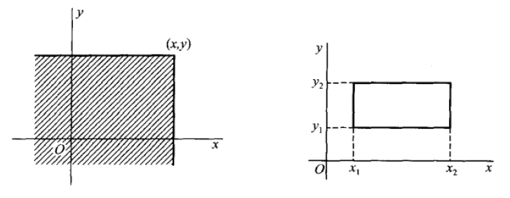

# 1. 二维随机变量

> 设 $E$ 是一个随机试验，其样本空间是 $S=\{e\}$ ，设 $X = X(e)$ 和 $Y = Y(e)$ 是定义在 $S$ 上的随机变量，由它们构成的一个向量 $(X,Y)$ 称作 **二维随机向量** 或 **二维随机变量**

(二维也可以推广到 n 维)

二维随机变量的分布函数 (或**联合分布函数**)：
$$F(x,y) = P\{(X \leq x) \cap (Y \leq y)\} = P\{X \leq x, Y \leq y\}$$

由上图易算出随机点 $(X,Y)$ 落在矩形区域 $\{(x,y) \mid x_1 \lt x \leq x_2, y_1 \lt y \leq y_2\}$ 的概率为：
$$P\{x_1 \lt X \leq x_2, y_1 \lt Y \leq y_2\} \\ = F(x_2, y_2) + F(x_1, y_1) - F(x_2, y_1) - F(x_1, y_2)$$

## 1.1 分布函数的性质

1. $F(x,y)$ 是变量 $x$ 和 $y$ 的不减函数
2. $0 \leq F(x,y) \leq 1$ ，且
   - 对于任意固定的 $y$ ，$F(-\infty, y) = 0$
   - 对于任意固定的 $x$ ，$F(x, -\infty) = 0$
   - $F(-\infty, -\infty) = 0$
   - $F(\infty, \infty) = 1$
3. $F(x+0, y) = F(x,y), F(x, y+0) = F(x,y)$ (右连续)
4. 对于任意 $(x_1, y_1), (x_2, y_2), x_1 \lt x_2, y_1 \lt y_2$ ，都有
   $$F(x_2, y_2) + F(x_1, y_1) - F(x_2, y_1) - F(x_1, y_2) \geq 0$$

## 1.2 离散型的二维随机变量

联合分布率

联合分布函数：
$$F(x,y) = \sum_{x_i \leq x}\sum_{y_i \leq y}p_{ij}$$

## 1.3 连续型的二维随机变量

存在非负的函数 $f(x,y)$ 使得对于任意的 $x,y$ 都有
$$F(x,y) = \int_{-\infty}^{y}\int_{-\infty}^{x}f(u,v)dudv$$

$f(x,y)$ 为**概率密度** (或**联合概率密度**)

$f(x,y)$ 的性质：

1. $f(x,y) \geq 0$
2. $\int_{-\infty}^{\infty}\int_{-\infty}^{\infty}f(x,y)dxdy = F(\infty, \infty) = 1$
3. 点 $(X,Y)$ 落在区域 $G$ 内的概率为
   $$P\{(X, Y) \in G\} = \iint_Gf(x,y)dxdy$$
4. 若 $f(x,y)$ 在点 $(x,y)$ 连续，则有
   $$\frac{\delta^2F(x,y)}{\delta x \delta y} = f(x,y)$$

# 2. 边缘分布

> **边缘分布函数**：二维随机变量 $(X,Y)$ 中的 $X$ 和 $Y$ 各自的分布函数 $F_X(x), F_Y(y)$

$$F_X(x) = P\{X \leq x\} = P\{X \leq x, Y \lt \infty\} = F(x, \infty)$$
即，
$$F_X(x) = F(x, \infty)$$
$$F_Y(y) = F(\infty, y)$$

## 2.1 离散型随机变量的边缘分布

$$F_X(x) = F(x, \infty) = \sum_{x_i \leq x}\sum_{j=1}^{\infty}p_{ij}$$

分布律为：
$$P\{X = x_i\} = p_{i\cdot} = \sum_{j=1}^{\infty}p_{ij}, \quad i=1,2,\ldots$$
$$P\{Y = y_i\} = p_{\cdot j} = \sum_{i=1}^{\infty}p_{ij}, \quad j=1,2,\ldots$$

## 2.2 连续型随机变量

$$F_X(x) = F(x, \infty) = \int_{-\infty}^{x}\bigg[\int_{-\infty}^{\infty}f(x,y)dy\bigg]dx$$

边缘概率密度：
$$f_X(x) = \int_{-\infty}^{\infty}f(x,y)dy$$
$$f_Y(y) = \int_{-\infty}^{\infty}f(x,y)dx$$

# 3. 条件分布

## 3.1 离散型随机变量的条件分布率

$$P\{X=x_i \mid Y = y_j\} = \frac{P\{X=x_i, Y=y_i\}}{P\{Y=y_j\}} = \frac{p_{ij}}{p_{\cdot j}}, i=1,2,\ldots$$
$$P\{Y=y_j \mid X = x_i\} = \frac{P\{X=x_i, Y=y_i\}}{P\{X=x_i\}} = \frac{p_{ij}}{p_{i\cdot}}, j=1,2,\ldots$$

## 3.2 连续型随机变量的条件分布

条件概率密度：
$$f_{X \mid Y}(x \mid y) = \frac{f(x,y)}{f_Y(y)}$$
对于固定的 $y$ ，$f_Y(y) \gt 0$

条件分布函数：
$$F_{X \mid Y}(x \mid y) = P\{X \leq x \mid Y = y\} = \int_{-\infty}^{x}\frac{f(x,y)}{f_Y(y)}dx$$

# 4. 相互独立的随机变量

# 5. 两个随机变量的函数的分布

## 5.1 $Z = X + Y$ 的分布

$$f_{X+Y}(z) = \int_{-\infty}^{\infty}f(z-y, y)dy = \int_{-\infty}^{\infty}f(x, z-x)dx$$

若 $X$ 和 $Y$ 相互独立，则：
$$f_{X+Y}(z) = \int_{-\infty}^{\infty}f_X(z-y)f_Y(y)dy = \int_{-\infty}^{\infty}f_X(x)f_Y(z-x)dx$$
这叫做 $f_X$ 和 $f_Y$ 的**卷积公式**，记作 $f_X * f_Y$

**有限个相互独立的正态随机变量的线性组合仍然服从正态分布**

## 5.2 $Z = \frac{Y}{X}$的分布

$$f_{Y/X}(z) = \int_{-\infty}^{\infty}|X|f(x,xz)dx$$

若 $X$ 和 $Y$ 相互独立，则：

$$f_{Y/X}(z) = \int_{-\infty}^{\infty}|X|f_X(x)f_Y(xz)dx$$

## 5.3 $Z  = XY$ 的分布

$$f_{XY}(z) = \int_{-\infty}^{\infty}\frac{1}{|X|}f(x, \frac{z}{x})dx$$

若 $X$ 和 $Y$ 相互独立，则：

$$f_{XY}(z) = \int_{-\infty}^{\infty}\frac{1}{|X|}f_X(x)f_Y(\frac{z}{x})dx$$

## 5.4 $M=\max\{X,Y\}$ 和 $N=\min\{X,Y\}$ 的分布

$$F_{\max}(z) = P\{M \leq z\} = P\{X \leq z, Y \leq z\} = P\{X \leq z\}P\{Y \leq z\}$$
即
$$F_{\max}(z) = F_X(z)F_Y(z)$$

$$F_{\min}(z) = 1 - [1 - F_X(z)][1 - F_Y(z)]$$
